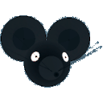

[cacilhas]: https://cacilhas.info/
[cutemaze]: https://gottcode.org/cutemaze/
[godot]: https://godotengine.org/
[itch]: https://cacilhas.itch.io/catcheese
[itch-app]: https://itch.io/app

# Catcheese

This game is inspired by [CuteMaze][cutemaze] and created using [Godot][godot]
3.3.2.

## Download

Get Catcheese from [Itch.io][itch] – use the [Itch app][itch-app].

## Commands

Use arrows or WASD keys to move straight or sideway and the mouse or QE keys to
turn left or right. Joypad works as well.

M key and L1/R1 buttons show panoramic view from above.

Use space key or Joypad’s X button to leave a danger mark.

Escape key and Joypad’s O return to the menu – or quit if it’s already there.

## License

- [The 3-Clause BSD License](COPYING)

## Author

- [Arĥimedeς Montegasppα][cacilhas]
